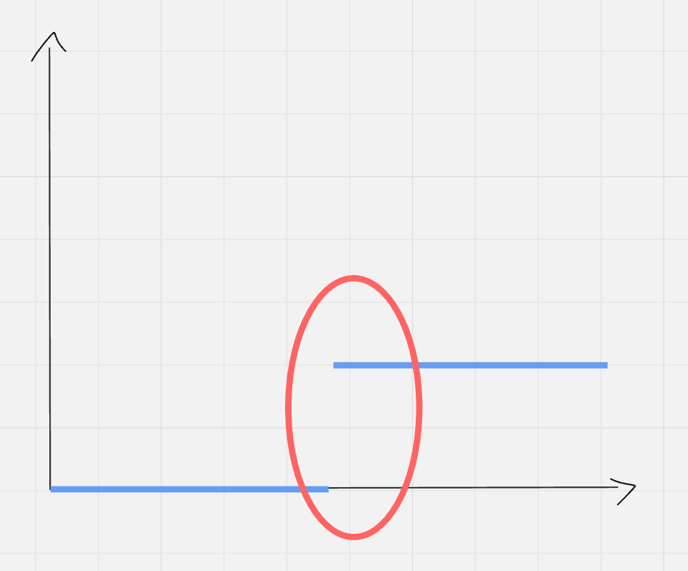

# Binary Search

Binary search is a method to efficiently find a value that satisfies a condition by testing the middle of the search range, and narrowing the range by 1/2 based on the result. Because we effectively divide the search space by 2 each iteration, the runtime of binary search is merely **logN**.

---

## How fast is logN?

* Say our search space was 1 to **1 billion**.
  Binary search would give us a result in ≤ 30 operations.

* Say our search space was 1 to **1 quintillion (1 billion billion)**.
  Binary search would give us a result in ≤ 60 operations.

> Imagine if we had to do complete search (O(n)) over that space!

---

# The Classic Example

Assume we had a sorted array with N numbers anywhere from 1 to 1 billion.
How can we efficiently check if a number exists in the array?

While going through every element would take O(n) time, we can accomplish this in O(logN) time with binary search.

```cpp
int arr[N];

bool binarySearch(int target) {
    int left = 0, right = N - 1;

    while (left <= right) {
        int mid = (right + left) / 2;

        if (arr[mid] == target) {
            return true;
        } else if (arr[mid] < target) {
            left = mid + 1;
        } else {
            right = mid - 1;
        }
    }

    return false;
}
```

---

## Why does this work?

Let's think about what we are doing. We're trying to find if `target` is in our array.
Our search space should be index 0 to N–1.

Now, let's check the middle of the space. By checking `mid`, we get some information on where the element should be.

* If `arr[mid] < target`, we know that `target` is somewhere further up the array **AND** it’s not the current element. So we move our `left` pointer to `mid + 1`, cutting our search space in half.
* If `arr[mid] > target`, we are too far into the array. The element should be somewhere lower, so we move the `right` pointer to `mid - 1`.

As we shrink our range, we check if we ever encounter `target` in `arr[mid]`. This can happen early on, or when the window is small enough that `l == r`. If we can't find it, `l` will cross `r` and our search space is depleted. Return `false`.

> **Think:** Would this work if the array is not sorted?

---

We can apply this general binary search idea to many different problems — even when we aren’t explicitly given an array to search on. Let’s try some problems.

---

# Problem: [Factory Machines - CSES](https://cses.fi/problemset/task/1620/)

Read the problem before taking a look at the solution.

---

### Hints

* Given a certain time limit `x`, can you determine if we can make `t` products?
* Can we brute force / complete search to find the solution? Yes — but this will be too slow, since `t` can be very large (> 1 billion).
* We can use binary search on an arbitrarily large search range (using long longs as `int`)!

> **Think:** What should we do in each mid check to narrow down our search space?

---

### Solution

```cpp
#include <bits/stdc++.h>
#define int long long
using namespace std;

int n, t;
const int N = 2e5 + 5;
int machines[N] = {};

bool check(int time) {
    int products = 0;

    for (int i = 0; i < n; i++) {
        products += (time / machines[i]);
        if (products >= t) return true;
    }

    return false;
}

signed main() {
    cin >> n >> t;

    for (int i = 0; i < n; i++) {
        cin >> machines[i];
    }

    int l = 1, r = 1e18;
    while (l < r) {
        int mid = (l + r) / 2;
        if (check(mid)) {
            r = mid;
        } else {
            l = mid + 1;
        }
    }

    cout << r << endl;
}
```

---

## Why binary search here?

The complete search would take `1e18 * N` time, but binary search reduces that to `N * log(1e18)`.

Assuming we can make `1e9` (1 billion) operations per second on an average computer:

* `1e18` operations would take **32 years**.
* Binary search reduces this down to just **60 operations**!

---

## Key Observations

* It's trivial to check if we can make `t` items under `x` seconds.
* Each check gives us information about the search space:

  * If we **can't** make `t` items under `x` seconds, our lower bound must increase.
  * If we **can**, our upper bound can decrease.

* The graph of the check function over the search space looks someting like this:
    * 

> **Think:**
> Why do we do `r = mid` when we can make `t` items, but `l = mid + 1` when we can’t?
